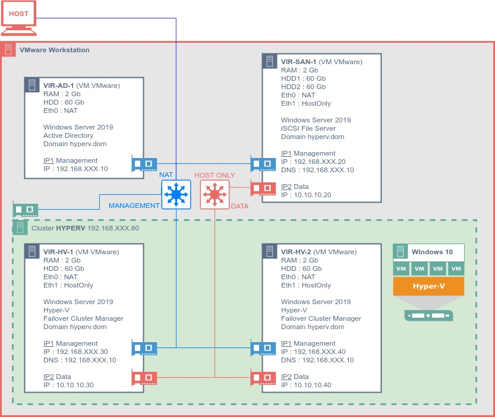

# Part 2 Cluster Hyper-V

# AD Server Install
In Workstation create new VM Windows Server 2019 :
Virtual machine name: `W2k19 Server AD`
Ram : default
Disk : default
Network : `NAT`

Language : `English`
Time ...: `French (Switzerland)`
Keyboard : `Swiss French`
OS : `Windows Server 2019 Standard (Desktop Experience)`
Password : `Pa$$w0rd`
Finish install

# Ad Server Config
Start VM `W2k19 Server AD`
Edit network : Static `192.168.XX.10`
Change name in config by : `VIR-AD-1`
Restart server

In **Server Manager** -> **Manage**, add Roles
Select server : `VIR-AD-1`
Server Roles : `Active Directory Domain Services`
Finish install
Restart server

In **Server Manager**, clic on the flag on the top and clic on **Promote this server to a domain controller**
Add new forest : `hyperv.dom`
Password : `Pa$$w0rd`
Finish install

# SAN iSCSI Install
Create new VM Windows Server 2019 :
Virtual machine name: `VIR-SAN-1`
Ram : default
Disk 1 : `60GB`
Disk 2 : `60GB`
Network 0 : `NAT`
Network 1 : `Host-Only`

Language : `English`
Time ...: `French (Switzerland)`
Keyboard : `Swiss French`
OS : `Windows Server 2019 Standard (Desktop Experience)`
Password : `Pa$$w0rd`
Finish install

# SAN iSCSI Config
Start VM `VIR-SAN-1`
Edit Network Nat : Static `192.168.XX.20` and DNS `192.168.XX.10`
Edit Network Host-Only : Static `10.10.10.20`
Change name : `VIR-SAN-1`
Change Domain : `hyperv.dom`

In **Server Manager** -> **Manage**, add roles **File and Storage Services** -> **File and iSCSI Services** -> `iSCSI Target Server`
Finish install

Open **Disk Management** and put Online Disk 1 and initialize it
Create new simple volume on Disk 1 :
Size : max
Drive letter : `S`
Volume label : `iSCSI`
Finish

**Server Manager** -> **File and Storage Services** -> **iSCSI**, start new iSCSI
Disk Location : volume `S`
Disk Name : `iSCSI-1`
Disk Size : max
Target Name : `virtual-target`
Acess Servers : DNSName `vir-san-1.hyperv.dom`
Finish creation

# HV 1 Install
Create new VM Windows Server 2019 :
Virtual machine name: `VIR-HV-1`
Ram : default
Disk : `60GB`
Network 0 : `NAT`
Network 1 : `Host-Only`

Language : `English`
Time ...: `French (Switzerland)`
Keyboard : `Swiss French`
OS : `Windows Server 2019 Standard (Desktop Experience)`
Password : `Pa$$w0rd`
Finish install

# HV 1 Config
Start VM `VIR-SAN-1`
Edit Network Nat : Static `192.168.XX.30` and DNS `192.168.XX.10`
Edit Network Host-Only : Static `10.10.10.30`
Change name : `VIR-HV-1`
Change Domain : `hyperv.dom`

# HV 1 HyperV Install
In **Server Manager** -> **Manage**, add roles `Hyper-V`
If you are an error :
shutdown VM, open the file *.vmx and add

    hypervisor.cpuid.v0 = "FALSE"
    mce.enable = "TRUE" 
    vhu.enable = "TRUE"
Edit Processors on VM and activate virtualize Intel and CPU

Continue installation of HyperV
Server Roles : `Hyper-V`
Hyper-V -> Virtual Switches : `Ethernet0`
Finish install

# HV 2
Repeat same of HV 1 with :
Virtual machine name: `VIR-HV-2`
Network Nat : Static `192.168.XX.40` and DNS `192.168.XX.10`
Network Host-Only : Static `10.10.10.40`
Name : `VIR-HV-2`

# Cluster